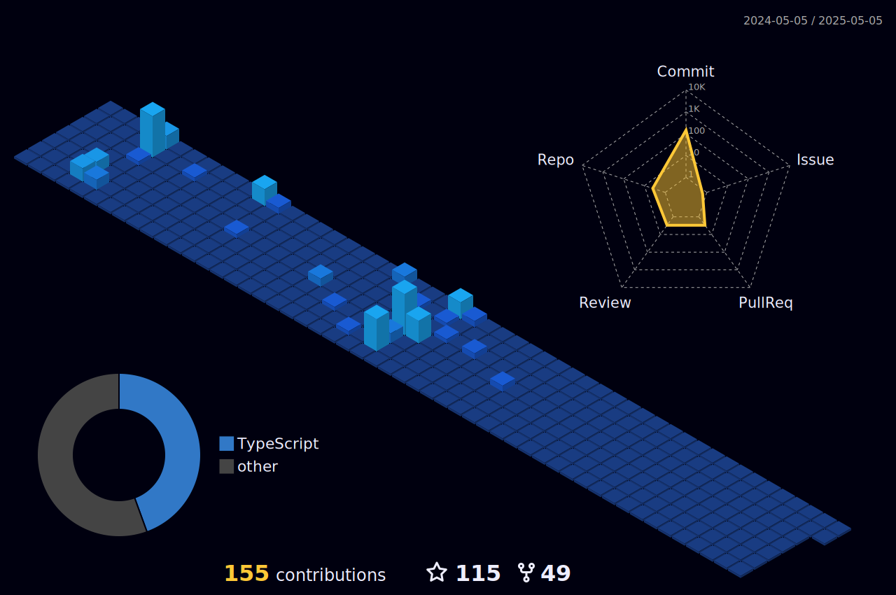

<!-- Visão 3D das contribuições -->

  

---

<!-- Estatísticas GitHub -->
<h2 align="center">📊 Estatísticas GitHub</h2>

  
  

  
  
  

---

<!-- Tecnologias que uso -->
<h2 align="center">🛠️ Tecnologias e Ferramentas</h2>

  

---

<!-- Troféus do GitHub -->
<h2 align="center">🏆 Conquistas GitHub</h2>

  

